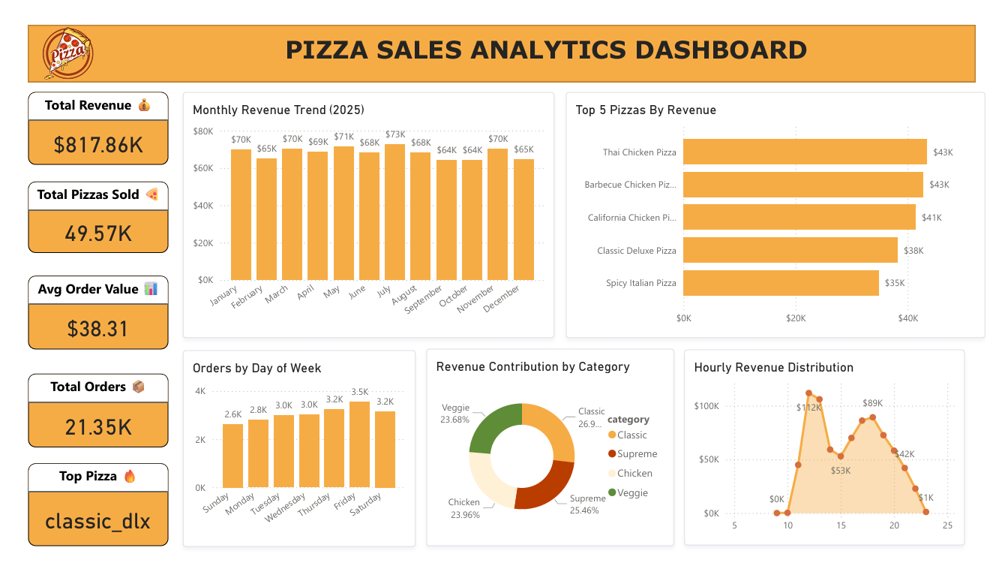
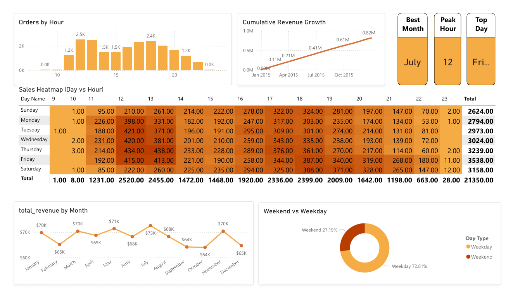
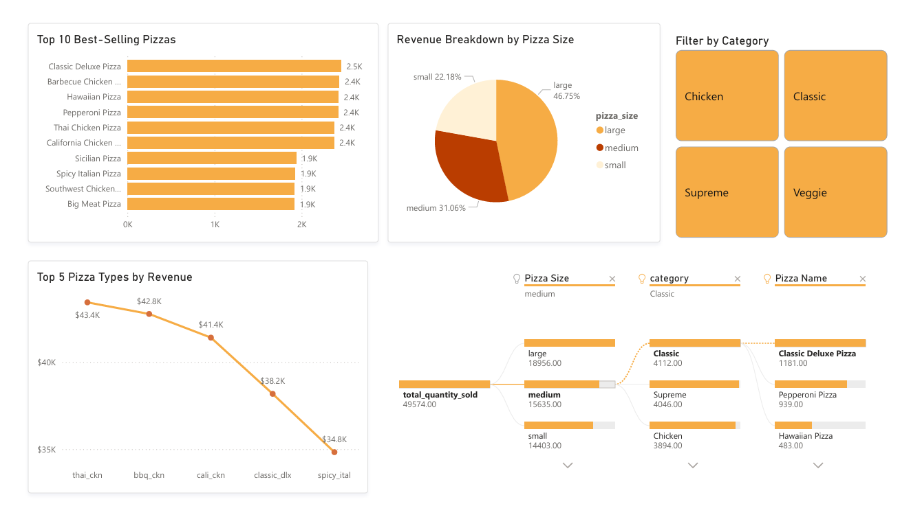

# 🍕 Pizza Sales Power BI Dashboard

  
*Interactive Power BI dashboard analyzing pizza sales trends, revenue, and customer behavior.*

This repository contains a **multi-page Power BI dashboard** built to explore pizza sales data from a real dataset. It’s designed to showcase insights for sales trends, top products, and customer ordering patterns.

---

## 📊 Dashboards Overview

### **1️⃣ Overview Dashboard**
  
- **Cards:** Total Revenue, Total Pizzas Sold, Average Order Value, Total Orders, Top Pizza  
- **Charts:** Monthly Revenue Trend 2025, Top 5 Pizzas by Revenue, Orders by Day of the Week, Revenue Contribution by Category, Hourly Revenue Distribution  

---

### **2️⃣ Time Analysis Dashboard**
  
- **Charts:** Orders by Hour, Cumulative Revenue Growth, Sales Heatmap, Total Revenue by Month, Weekend vs Weekday Comparison  
- **Cards:** Top Month, Top Day, Best Month  

---

### **3️⃣ Pizza Insights Dashboard**
  
- **Charts:** Top-10 Best Selling Pizzas, Revenue Breakdown, Decomposition Tree (Total Quantity Sold)  
- **Slicer:** Filter by Pizza Category  
- **Top 5 Pizza Types by Revenue**  

---

## 📂 Dataset
- **Source:** [Maven Analytics – Pizza Place Sales](https://mavenanalytics.io/data-playground/pizza-place-sales)  
- **Format:** CSV  
- **Description:** Includes order-level data such as pizza type, quantity, price, and order timestamps.

---

## 🚀 Key Features & Learnings
- Multi-page dashboards for **overall sales, time trends, and product insights**  
- Interactive **charts, cards, and slicers** for dynamic exploration  
- Advanced **visualizations**: decomposition tree, heatmaps, trend analysis  
- Hands-on practice with **Power BI modeling, DAX measures, and storytelling with data**  

---

## 📈 Insights You Can Explore
- Top-selling pizzas and pizza types by revenue  
- Monthly, hourly, and daily revenue trends  
- Weekend vs weekday sales patterns  
- Quantity sold by category and pizza type  

---

## 🛠 Tools Used
- **Power BI Desktop** – For creating dashboards  
- **DAX** – For calculations and measures  
- **CSV Dataset** – From Maven Analytics  

---

## 💡 Future Improvements
- Customer segmentation analysis  
- Seasonal trends and promotions  
- Integration with real-time sales data  
- Predictive analytics for next-best pizza recommendations  

---

## 📌 How to Explore
1. Download the `.pbix` file from this repository  
2. Open it in Power BI Desktop  
3. Interact with **slicers, cards, and charts** to explore insights  

---

## 🎯 Learning Journey
This project helped me enhance my **data modeling, visualization, and storytelling skills** in Power BI. Working with real-world sales data was a fun and practical way to learn.

---

